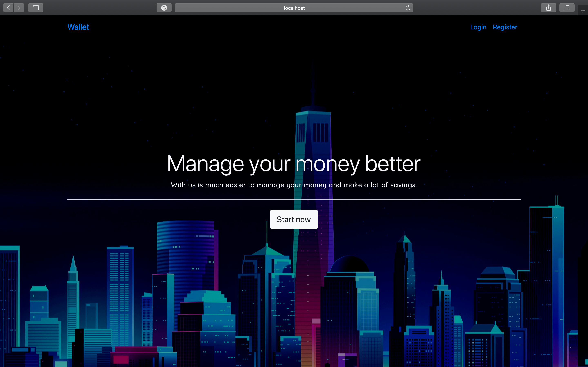
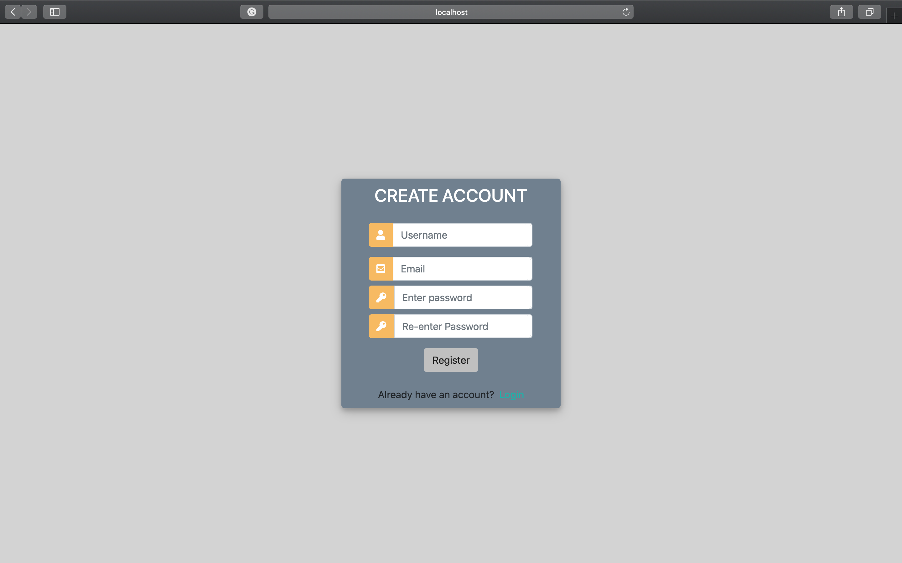
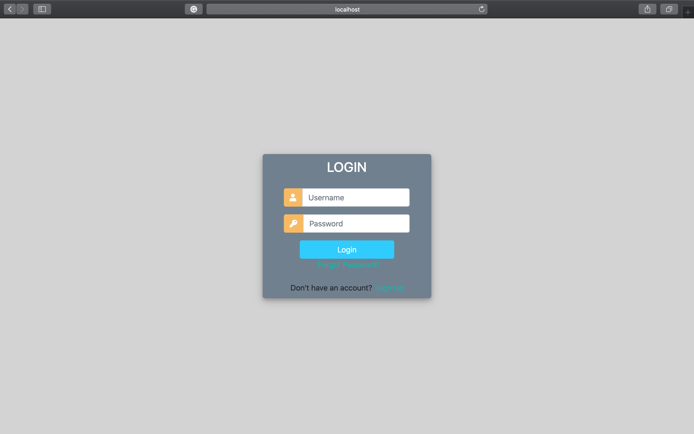
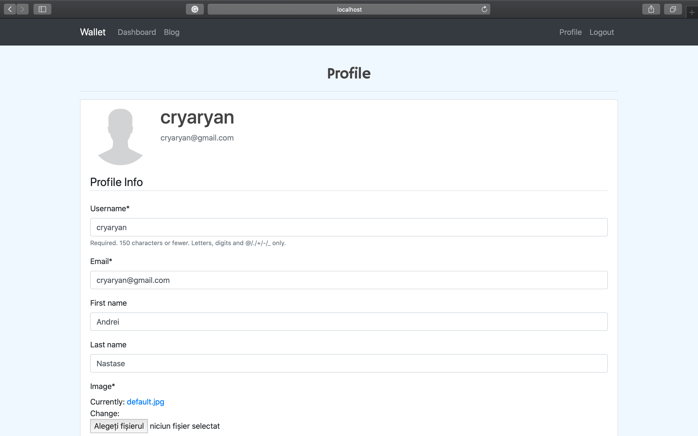
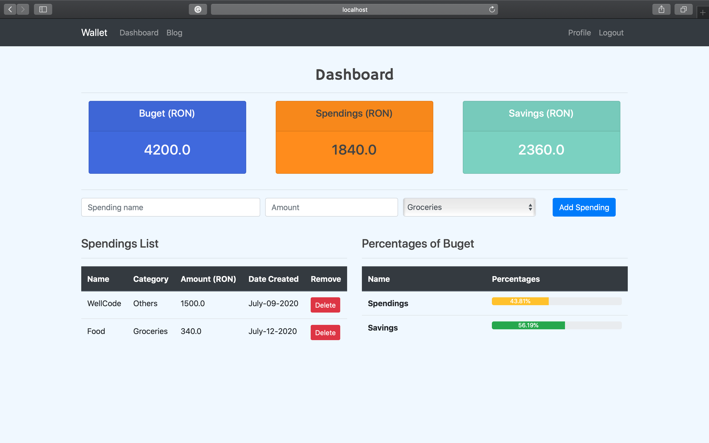
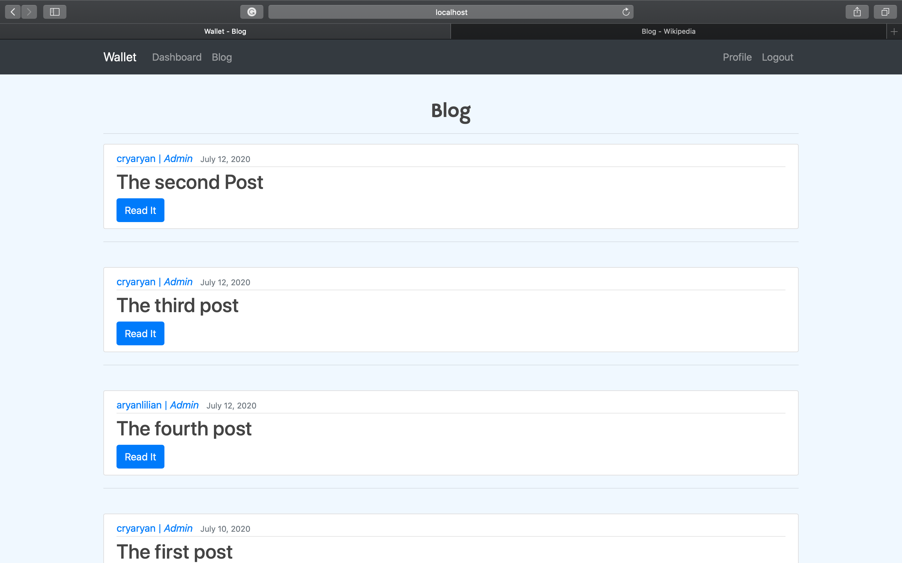
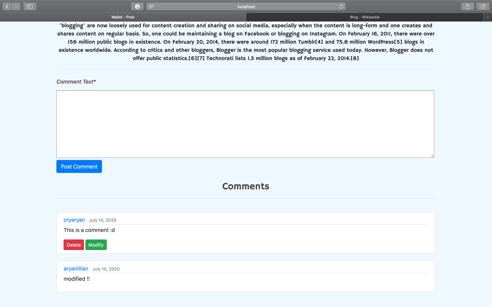

# Spendings-Tracker-Web-App
I've built this website because I want to help a lot of people to manage their funds more efficiently and to have a lot of savings every month, in order to can start some small business or make a lot of investments. 

The website has a Profile-Page where you can set some personal information and you're personally budged and the currency of your personal wallet on the site. 

The dashboard page is the page where you can add every time you want personalized spending. All the spendings have a total and you get your current total savings automatically with our website every time you add new spending. The total savings = your budget - total spendings. On the Dashboard-Page you can see also how much of your budget are the spendings and the savings (in percentages). 

The Blog-Page is a page where you can read a lot of posts about money or how to manage them better and make savings, investments, etc. Also on this page for every post, you can write a comment and discuss it with other users on the website. 

Index-Page:

Register-Page:

Login-Page:

Profile-Page:

Dashboard-Page:

Blog-Page:

Post-Page:

