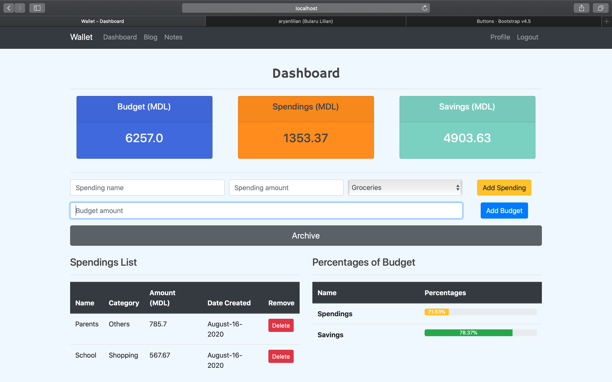
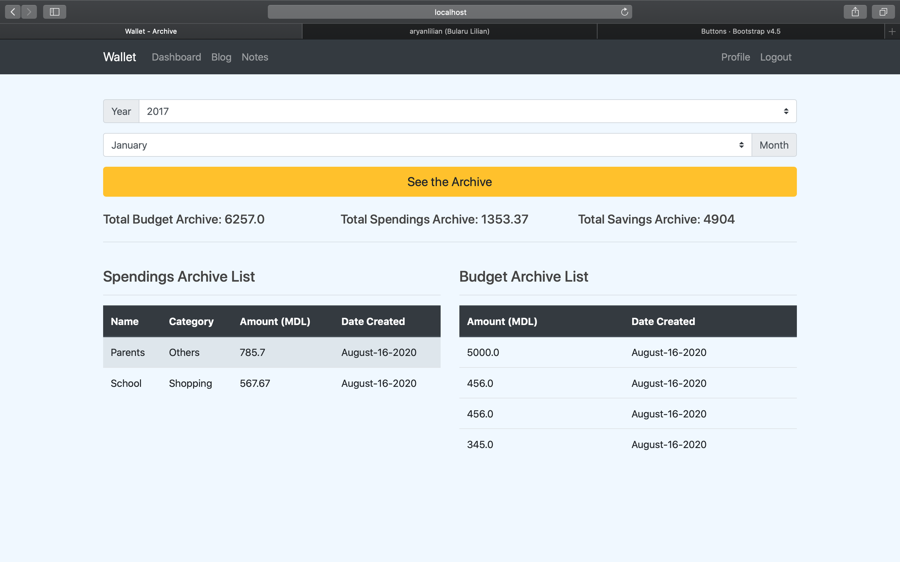

# Electronic-Spendings-Tracker
I've built this website because I want to help a lot of people to manage their funds more efficiently and to have a lot of savings every month, in order to start some small business or make a lot of investments. 

The website has a Profile-Page where you can set some personal information and you're personally currency of your personal wallet on the site. 

The dashboard page is the page where you can add every time you want personalized spending and budget. All the spendings and budget have a total and you get your current total automatically with our website every time you add new spending or budget. The total savings = your total budget - total spendings. On the Dashboard-Page you can see also how much of your budget are the spendings and the savings (in percentages). 

The Blog-Page is a page where you can read a lot of posts about money or how to manage them better and make savings, investments, etc. Also on this page for every post, you can write a comment and discuss it with other users on the website. 

Recently I've added a new feature that consists of making notes list and every list has a specific name, user, and a category. Every user can add as many tasks he/she wants in their list, every list and task has a full CRUD feature available.

Archive-Page is a new update, practically you can see all your spendings, budgets, and savings from a specific year and month, as an archive. All the information are selected from the database to make the user experience more efficient

#### Features that I implemented so far:
    - Google API (Login with Google)
    - Facebook API (Login with Facebook)
    - GitHub API (Login with GitHub)
    - PostgreSQL Database Register and Authentication
    - Full CRUD feature on User Profile
    - Full CRUD feature on objects (Spendings, Budgets, Notes, Tasks)
    - Archive feature (Selecting specific objects from the Databases)
    - User comments feature

Index-Page:

Register-Page:

Login-Page:

Profile-Page:

Dashboard-Page:

Blog-Page:

Post-Page:

Notes-Page:

Tasks-Page:

Archive-Page:

